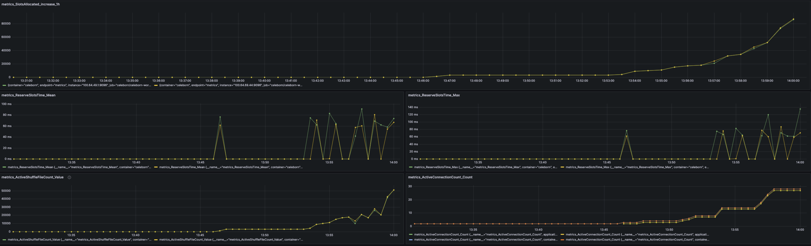

# emr-on-eks-karpenter-rss

## Installation

### Deploy the infrastructure

#### Modify the terraform

Clone the repository

```shell
git clone https://github.com/awslabs/data-on-eks.git
cd ./data-on-eks/analytics/terraform/emr-eks-karpenter
terraform init
```

Modify the variables.tf

disable AMP, enable Spark Operator

```shell
variable "enable_amazon_prometheus" {
  description = "Enable AWS Managed Prometheus service"
  type        = bool
  default     = false
}


variable "enable_emr_spark_operator" {
  description = "Enable the Spark Operator to submit jobs with EMR Runtime"
  type        = bool
  default     = true
}
```


Deloy the EKS cluster and related component(prometheus, Karpenter, kubecost, etc.)

```shell
chmod +x install.sh
./install.sh
```

Check if the EKS cluster is up and in function

```shell
kubectl get nodes
kubectl get pods -A
```


### Deploy Aapache Celeborn

Clone the repository
```shell
git  clone https://github.com/hitsub2/emr-on-eks-karpenter-rss
```

Apply Karpenter Nodepool for celeborn

```shell
cd emr-on-eks-karpenter-rss
kubectl apply -f karpenter/*
```

Deploy the Apache Celeborn charts
```shell
cd emr-on-eks-karpenter-rss # make sure it is the root directory of this repo
helm install celeborn charts/celeborn -n celeborn --create-namespace 
```

Check the Celeborn service status

```shell
kubectl get pods -n celeborn
```

output

```shell
NAME                READY   STATUS    RESTARTS   AGE
celeborn-master-0   1/1     Running   0          2d
celeborn-master-1   1/1     Running   0          2d
celeborn-master-2   1/1     Running   0          2d
celeborn-worker-0   1/1     Running   0          2d
celeborn-worker-1   1/1     Running   0          2d
```

## Run examples

### Prepare the data

```shell
cd emr-on-eks-karpenter-rss/examples
# modify the parameters if needed
kubectl apply -f tpcds-data-gen.yaml
```

### Run benchmark job

```shell
cd emr-on-eks-karpenter-rss/examples
./emr6.15-rss.sh
```

## Observability for Job tracking

## Celeborn Dashboard


